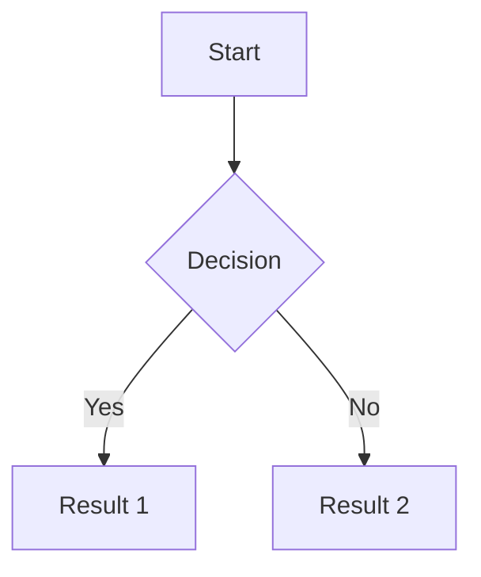

# MarkMyWord Documentation

Bidirectional conversion between Markdown and Word documents according to [CommonMark 0.31.2](https://spec.commonmark.org/0.31.2/) and [ECMA-376](https://www.ecma-international.org/publications-and-standards/standards/ecma-376/).

## What is MarkMyWord?

MarkMyWord is a .NET library and command-line tool for converting between CommonMark-formatted Markdown and Microsoft Word (.docx) documents. It provides high-fidelity conversion with support for syntax highlighting, Mermaid diagrams, tables, and all standard Markdown elements.

## Installation

### Library

Install the library via NuGet:

```bash
dotnet add package SpecWorks.MarkMyWord
```

### CLI Tool

Install the command-line tool globally:

```bash
dotnet tool install --global SpecWorks.MarkMyWord.Cli
```

## Features

- ✅ **CommonMark 0.31.2 Compliant** - Full implementation of CommonMark specification
- ✅ **ECMA-376 Compliant** - Standard Office Open XML document format
- ✅ **Bidirectional Conversion** - Convert Markdown to Word and Word to Markdown
- ✅ **Syntax Highlighting** - Code blocks with language-specific highlighting
- ✅ **Mermaid Diagrams** - Render Mermaid diagrams as images in Word
- ✅ **Tables** - Full table support with alignment
- ✅ **Images** - Embed and extract images
- ✅ **Links** - Preserve hyperlinks in both directions
- ✅ **Styles** - Proper heading levels, emphasis, and formatting
- ✅ **Lists** - Ordered and unordered lists with nesting
- ✅ **CLI Tool** - Command-line interface for batch processing
- ✅ **Type-Safe API** - Strong typing with nullable reference types
- ✅ **Multi-Target** - Supports .NET 10.0 and .NET 8.0 (LTS)

## Quick Start

### Library Usage - Markdown to Word

```csharp
using SpecWorks.MarkMyWord;

// Convert Markdown string to Word document
string markdown = @"# Hello World

This is a **bold** statement with *italic* text.

## Code Example

```csharp
var greeting = ""Hello, World!"";
Console.WriteLine(greeting);
```
";

var converter = new MarkdownToWordConverter();
using var wordDocument = converter.Convert(markdown);

// Save to file
wordDocument.SaveAs("output.docx");
```

### Library Usage - Word to Markdown

```csharp
using SpecWorks.MarkMyWord;

// Convert Word document to Markdown
var converter = new WordToMarkdownConverter();
string markdown = converter.Convert("input.docx");

// Save to file
File.WriteAllText("output.md", markdown);
```

### CLI Usage

```bash
# Convert Markdown to Word
markmyword convert document.md document.docx

# Convert Word to Markdown
markmyword convert document.docx document.md

# Convert directory of files
markmyword convert --input-dir ./docs --output-dir ./word

# Watch mode - auto-convert on file changes
markmyword watch document.md document.docx
```

## Use Cases

### Documentation Publishing

Convert Markdown documentation to Word for distribution:

```csharp
var converter = new MarkdownToWordConverter();

// Process all documentation files
foreach (var mdFile in Directory.GetFiles("docs", "*.md"))
{
    var markdown = File.ReadAllText(mdFile);
    using var wordDoc = converter.Convert(markdown);

    var outputPath = Path.ChangeExtension(mdFile, ".docx");
    wordDoc.SaveAs(outputPath);
}
```

### Specification Documents

Convert technical specifications to Word format:

```csharp
// Read specification in Markdown
var specMarkdown = File.ReadAllText("specification.md");

var converter = new MarkdownToWordConverter(new ConversionOptions
{
    EnableSyntaxHighlighting = true,
    EnableMermaidDiagrams = true,
    IncludeTableOfContents = true
});

using var wordDoc = converter.Convert(specMarkdown);
wordDoc.SaveAs("specification.docx");
```

### Content Migration

Migrate content from Word to Markdown:

```csharp
var converter = new WordToMarkdownConverter();

// Convert legacy Word documents to Markdown
foreach (var docxFile in Directory.GetFiles("legacy", "*.docx"))
{
    var markdown = converter.Convert(docxFile);

    var outputPath = Path.ChangeExtension(docxFile, ".md");
    File.WriteAllText(outputPath, markdown);
}
```

### Continuous Documentation

Automate documentation generation:

```csharp
// Watch for changes and auto-convert
var watcher = new FileSystemWatcher("docs", "*.md");
watcher.Changed += (sender, e) =>
{
    var converter = new MarkdownToWordConverter();
    var markdown = File.ReadAllText(e.FullPath);
    using var wordDoc = converter.Convert(markdown);

    var outputPath = Path.ChangeExtension(e.FullPath, ".docx");
    wordDoc.SaveAs(outputPath);
    Console.WriteLine($"Converted {e.Name} to Word");
};
watcher.EnableRaisingEvents = true;
```

## API Reference

- [MarkMyWord API Documentation](api/SpecWorks.MarkMyWord.html) - Library API reference
- [MarkMyWord.CLI API Documentation](api/SpecWorks.MarkMyWord.CLI.html) - CLI API reference

## Specification Compliance

This library implements:

- [CommonMark Specification 0.31.2](https://spec.commonmark.org/0.31.2/)
- [ECMA-376: Office Open XML File Formats](https://www.ecma-international.org/publications-and-standards/standards/ecma-376/)

### Supported CommonMark Elements

| Element | Status |
|---------|--------|
| Headings (ATX) | ✅ Supported |
| Headings (Setext) | ✅ Supported |
| Paragraphs | ✅ Supported |
| Line Breaks | ✅ Supported |
| Emphasis (*italic*) | ✅ Supported |
| Strong (**bold**) | ✅ Supported |
| Code Spans | ✅ Supported |
| Code Blocks | ✅ Supported |
| Fenced Code Blocks | ✅ Supported |
| Syntax Highlighting | ✅ Supported |
| Links | ✅ Supported |
| Images | ✅ Supported |
| Ordered Lists | ✅ Supported |
| Unordered Lists | ✅ Supported |
| Nested Lists | ✅ Supported |
| Blockquotes | ✅ Supported |
| Horizontal Rules | ✅ Supported |
| Tables (GFM) | ✅ Supported |

### Extended Features

| Feature | Status |
|---------|--------|
| Mermaid Diagrams | ✅ Supported |
| Syntax Highlighting (JSON) | ✅ Supported |
| Syntax Highlighting (TypeSpec) | ✅ Supported |
| Syntax Highlighting (Bash) | ✅ Supported |
| Syntax Highlighting (C#) | ✅ Supported |
| Syntax Highlighting (HTTP) | ✅ Supported |
| Table Alignment | ✅ Supported |

## CLI Reference

### Commands

```bash
markmyword convert <input> <output> [options]
markmyword watch <input> <output> [options]
```

### Convert Command

Convert a file or directory between Markdown and Word formats.

```bash
markmyword convert input.md output.docx [options]
```

#### Options

- `--input-dir <path>` - Input directory (for batch conversion)
- `--output-dir <path>` - Output directory (for batch conversion)
- `--syntax-highlighting` - Enable syntax highlighting (default: true)
- `--mermaid` - Enable Mermaid diagram rendering (default: true)
- `--toc` - Include table of contents (default: false)
- `--overwrite` - Overwrite existing files (default: false)

#### Examples

```bash
# Convert single file
markmyword convert README.md README.docx

# Convert directory
markmyword convert --input-dir ./markdown --output-dir ./word

# Convert with options
markmyword convert spec.md spec.docx --toc --mermaid
```

### Watch Command

Watch a file for changes and automatically convert.

```bash
markmyword watch input.md output.docx [options]
```

#### Examples

```bash
# Watch and auto-convert
markmyword watch document.md document.docx

# Watch with options
markmyword watch spec.md spec.docx --syntax-highlighting --toc
```

## Syntax Highlighting

Supported languages for code block syntax highlighting:

- C# (`csharp`, `cs`)
- JSON (`json`)
- TypeSpec (`typespec`, `tsp`)
- Bash/Shell (`bash`, `sh`)
- HTTP (`http`)
- JavaScript (`javascript`, `js`)
- Python (`python`, `py`)
- And many more...

Example:

````markdown
```csharp
public class Example
{
    public string Message { get; set; } = "Hello, World!";
}
```
````

## Mermaid Diagrams

MarkMyWord supports Mermaid diagram rendering:

````markdown

````

Diagrams are rendered as PNG images and embedded in the Word document.

## Requirements

- .NET 10.0 or .NET 8.0 (LTS)
- C# 10.0 or later
- For Mermaid diagrams: Playwright browsers (installed automatically)

## Source Code

View the source code on [GitHub](https://github.com/spec-works/MarkMyWord).

## Contributing

Contributions welcome! See the [repository](https://github.com/spec-works/MarkMyWord) for:
- Issue tracking
- Pull request guidelines
- Architecture Decision Records (ADRs)

## License

MIT License - see [LICENSE](https://github.com/spec-works/MarkMyWord/blob/main/LICENSE) for details.

## Links

- **GitHub Repository**: [github.com/spec-works/MarkMyWord](https://github.com/spec-works/MarkMyWord)
- **CommonMark Specification**: [spec.commonmark.org/0.31.2](https://spec.commonmark.org/0.31.2/)
- **ECMA-376 Specification**: [ecma-international.org/publications-and-standards/standards/ecma-376](https://www.ecma-international.org/publications-and-standards/standards/ecma-376/)
- **SpecWorks Factory**: [spec-works.github.io](https://spec-works.github.io)
