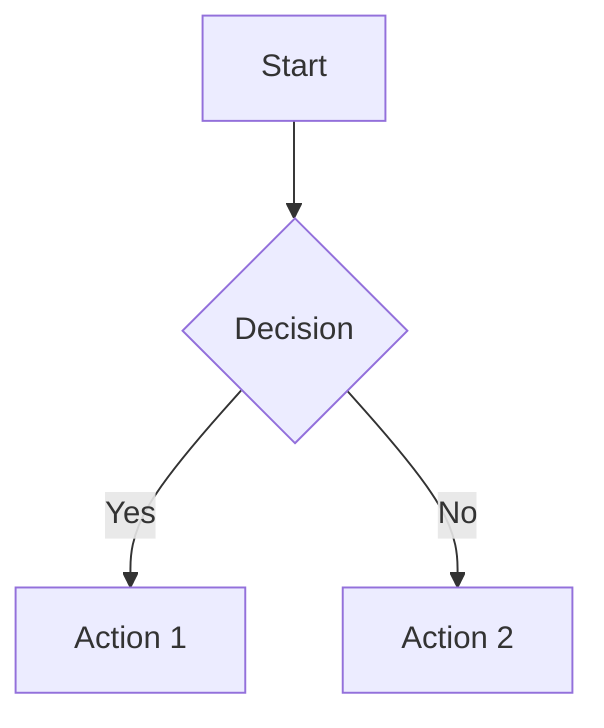

# Mermaid Diagram Support

MarkMyWord supports rendering Mermaid diagrams in Word documents using [Naiad](https://github.com/nickvdyck/naiad), a pure .NET Mermaid-to-SVG renderer.

## No Additional Setup Required

Unlike the previous Playwright-based approach, Naiad runs entirely in .NET — **no browser install, no system dependencies, and no external processes**. Mermaid rendering works out of the box on all platforms.

## Usage

Mermaid diagrams in your markdown are automatically rendered as images in the Word output:

````markdown

````

### Configuration Options

You can configure Mermaid diagram rendering via `ConversionOptions`:

```csharp
var options = new ConversionOptions
{
    EnableMermaidDiagrams = true,        // Toggle Mermaid rendering (default: true)
    MaxDiagramWidthInches = 6.5,         // Max diagram width (default: 6.5)
    MaxDiagramHeightInches = 8.0         // Max diagram height (default: 8.0)
};

MarkdownConverter.ConvertToDocx(markdown, "output.docx", options);
```

## Supported Mermaid Diagram Types

All diagram types supported by Naiad are available, including:
- Flowcharts
- Sequence diagrams
- Class diagrams
- State diagrams
- Entity Relationship diagrams
- Gantt charts
- Pie charts
- Git graphs
- And more...

## Troubleshooting

### Mermaid Syntax Errors

If a diagram fails to render, MarkMyWord will fall back to rendering it as a plain code block with an error message. Check that your Mermaid syntax is valid at [Mermaid Live Editor](https://mermaid.live).
